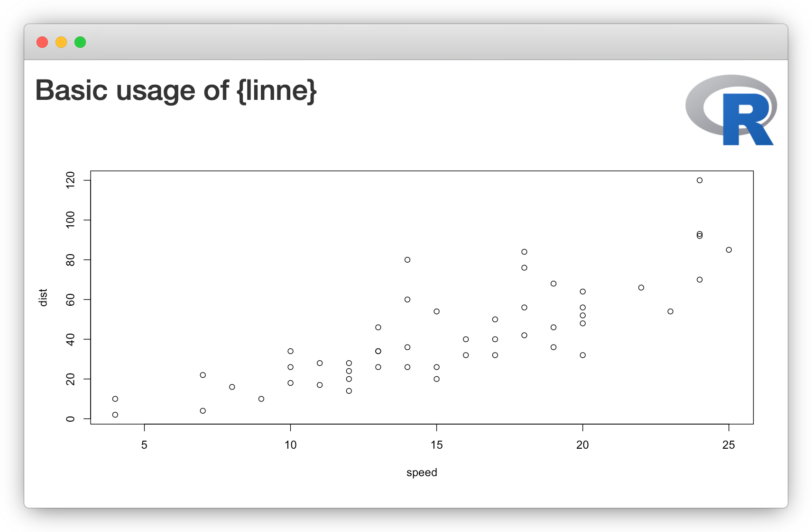

# linne

linne makes basic CSS easier for R users. It is intended as a stepping stone to actually writing CSS and SCSS.

## Installation

It is not yet on CRAN but is available on Github:

```r
# install.packages("remotes")
remotes::install_github("JohnCoene/linne")
```

## Example

Using linne to place a logo in the top right of the app.

```r
library(shiny)
library(linne)

linne <- Linne$
  new()$
  change(
    sel_id("logo"),
    position = "absolute",
    top = 20,
    right = 20,
    maxHeight = 75,
    zIndex = 9999
  )

ui <- fluidPage(
  linne$include(),
  h2("Basic usage of {linne}"),
  img(src = "https://www.r-project.org/logo/Rlogo.png", id = "logo"),
  plotOutput("plot")
)

server <- function(input, output){
  output$plot <- renderPlot(plot(cars))
}

shinyApp(ui, server)
```


