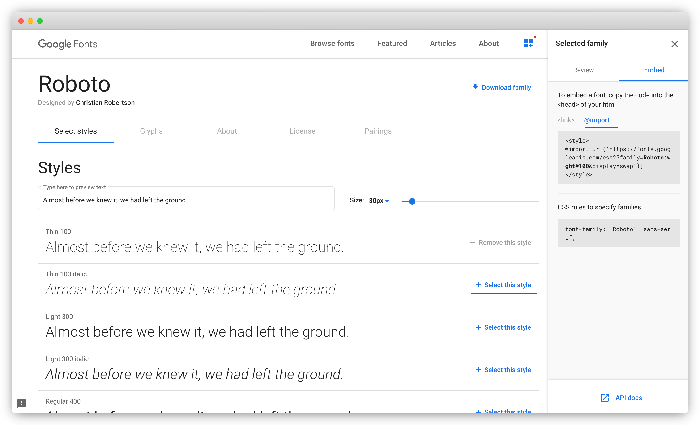

```{r, include = FALSE}
knitr::opts_chunk$set(
  collapse = TRUE,
  comment = "#>"
)

library(linne)
```

## Define

You can use the `define` method to define global variables. This can make things clearer and more efficient. Note that these variables are referred to by their bare (unquoted) names in the `rule` method.

```{r}
Linne$
  new()$
  define(
    theme = "blue",
    font_size = 20
  )$
  rule(
    sel_tag("h1"),
    color = theme,
    fontSize = font_size
  )$
  rule(
    sel_tag("p"),
    color = theme
  )
```

In the example above were I to later want to change the `theme` color it would have to be changed in only one place.

## Import

There is a method called `import` which corresponds to the CSS at-rule of the same name. It allows importing other CSS files. It is often used for fonts.

For instance to use [Google fonts](https://fonts.google.com/) visit the [website](https://fonts.google.com/), Click a font you would like to use from the main grid then (see print screen below) click "Select this style," this should open a drawer on the right from which you can copy the URL and CSS rule to use that font.



The Robot font (print screen above) can thus be applied like so.

```{r}
Linne$
  new()$
  import("https://fonts.googleapis.com/css2?family=Roboto:wght@100&display=swap")$
  rule(
    sel_all(),
    fontFamily = "'Roboto', sans-serif"
  )
```
