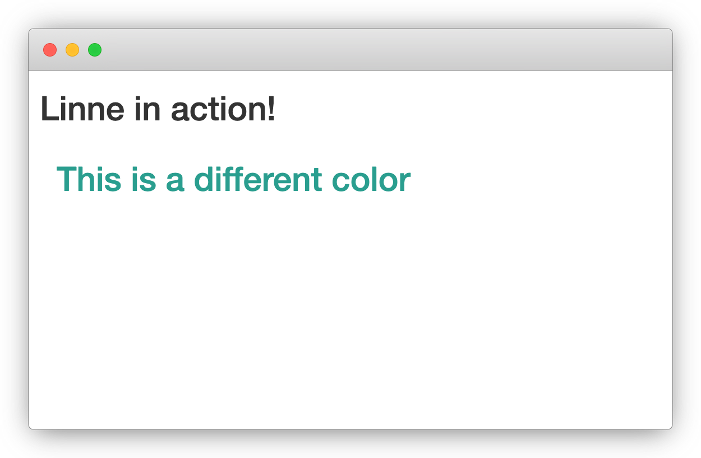

```{r, include = FALSE}
knitr::opts_chunk$set(
  collapse = TRUE,
  comment = "#>"
)

library(linne)
```

## Introduction

There are two core actions to linne: first you select an element (e.g.: a button) then apply changes (e.g.: change the colour).

At its core the package consists of a family of selectors and a reference class. This reference class is instantiated from the `Linne` object with the `new` method.

```r
linne <- Linne$new()
```

Almost every method returns the `Line` object (self) so it can be easily piped.

## Select

A core concept is that of selecting elements (to subsequently change their style). This is done mainly via the `sel_*` family of functions.

```r
shiny::p("Hello Linne", id = "myId")
```

```{r, echo = FALSE}
cat(as.character(shiny::p("Hello Linne", id = "myId")))
```

For instance, were one want to change the style of the element above, one could select it using its `id` with:

```{r}
sel_id("myId")
```

Note that this prints the console the actual CSS selector it generates. There are many such `sel_*` functions, one could also select all `p()` and change them all at once.

```{r}
sel_tag("p")
```

The selectors are not useful on their own, they are meant to be used together with the `rule` method where they indicate the element(s) one wants to change.

## Rule

With elements selected one can change the way they look. There are way too many such attributes to list, you will find a comprehensive list on [w3schools](https://www.w3schools.com/cssref/).

```r
linne <- Linne$
  new()$
  rule(
    sel_id("myId"),
    fontSize = 20,
    color = "blue"
  )
```

Two things to note on the above, linne automatically converts integers and numerics into pixels: the above changes the size of the font of the element with `id = "myId"` to 20 pixels. Second, linne accepts camelCase, where the CSS uses hyphens: above we use `fontSize` instead of `font-size`. Note that you may pass the original CSS attributes but have to do so with backticks.

## Show CSS

In order to learn and understand more about CSS you can use the `show_css` method to print the generated CSS to the console.

```{r}
Linne$
  new()$
  rule(
    sel_tag("p"),
    fontSize = 30,
    fontStyle = "italic",
    color = "darkblue"
  )$
  show_css()
```

## Include

Thus far we have generated CSS with linn but are yet to include it anywhere, below we show how to include it in a shiny application.

```r
library(shiny)
library(linne)

linne <- Linne$
  new()$
  rule(
    sel_tag("p"),
    fontSize = 30,
    fontStyle = "italic",
    color = "darkblue"
  )

ui <- fluidPage(
  linne$include(),
  p("Hello {linne}!")
)

server <- function(input, output) {}

shinyApp(ui, server)
```


<a href="rmarkdown.html" class="btn btn-primary">Use in R markdown</a>

## Example

Below using child to only apply changes to the `h2` tag within the `container`.

```r
library(shiny)
library(linne)

# change color fo h2 inside container.
linne <- Linne$
  new()$
  rule(
    sel_class("container") %child% sel_tag("h2"),
    color = "#2a9d8f"
  )

ui <- fluidPage(
  linne$include(), # include CSS
  h2("Linne in action!"),
  div(
    class = "container",
    h2("This is a different color")
  )
)

server <- function(input, output){}

shinyApp(ui, server)
```


