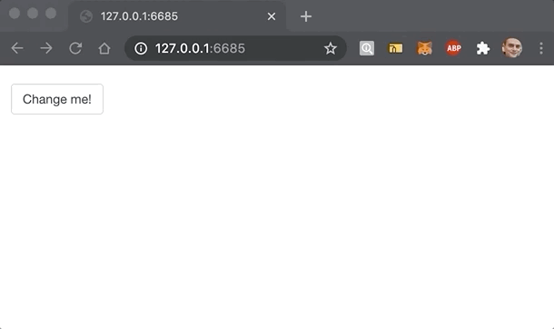

```{r, include = FALSE}
knitr::opts_chunk$set(
  collapse = TRUE,
  comment = "#>"
)

library(linne)
```

## Introduction

There are two main ways to use linne in shiny apps: 1) a convenient but inefficient one 2) an efficient but less flexible way.

## Include

In shiny the easiest way to add the CSS to an application is to use the `include` method. Note however, that this is not advised in production, see the [`write`](#write) to improve performances.

```r
library(linne)
library(shiny)

linne <- Linne$
  new()$
  rule(
    sel_id("btn"),
    color = "white",
    backgroundColor = "red"
  )

ui <- fluidPage(
  linne$include(), # incude CSS
  actionButton("btn", "I'm a red button")
)

server <- function(input, output){}

shinyApp(ui, server)
```

## Inject

You can generate the CSS using `Linne` as per usual then inject it dynamically in the page with the `inject` method. Note that for this you will need to place `useLinne` in UI of shiny page.

```r
library(linne)
library(shiny)

linne <- Linne$
  new()$
  rule(
    sel_id("change"),
    color = "white",
    backgroundColor = "black"
  )

ui <- fluidPage(
  useLinne(), # only required for inject method
  actionButton("change", "Change me!")
)

server <- function(input, output){

  observeEvent(input$change, {
    linne$inject()
  })

}

shinyApp(ui, server)
```



## Write

The `include` method will (by default) build the CSS every time it is called making it inefficient for prod. When deploying an app it is always better to save the generated CSS to a file then link that file in the shiny application. 

Note that the CSS file has to be served in order to be accessible by the browser. RStudio defaults to the `www` directory, if you wish to place it in another directory you will have to use `shiny::addResourcePath`.

```r
dir.create("www") # create static asset directory

Linne$
  new()$
  rule(
    sel_tag("p"),
    color = "white",
    fontSize = 30
  )$
  write("www/style.css") # save 
```

Then use the `link` tag to link to the CSS file.

```r
library(linne)
library(shiny)

ui <- fluidPage(
  tags$head(
    tags$link(rel = "stylesheet", href = "www/style.css")
  ),
  p("This is rather large text"),
  p("This too!")
)

server <- function(input, output){}

shinyApp(ui, server)
```
